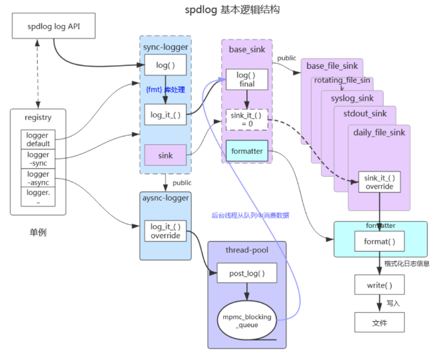

# spdlog的整体架构
spdlog是一个c++日志库，其特点是简单和使用方便，其整体架构：
  

## spdlog中的核心组件

spdlog中的核心组件：
- **logger**，日志器，是spdlog处理日志的入口，logger会将各种日志信息收集起来，最终集中到一个log_msg对象中，然后再交给sink去处理；
- **sink**，输出器，负责处理logger传递下来的log_msg对象，并通过formatter将这个log_msg对象处理成最终要展示的字符串，并输出到指定的目的地（可以是控制台、文件、网络等）;
- **formatter**，日志的格式化器，被sink调用，负责将log_msg对象中的信息转成最终的字符串，主要是处理用户设置的日志格式，以及那些特殊的字符（例如%H、%M、%S、%v等）；
- **redistry**，注册中心，单例对象，负责管理所有的logger，还有全局的等级、线程池（异步用）、formatter、锁等；

